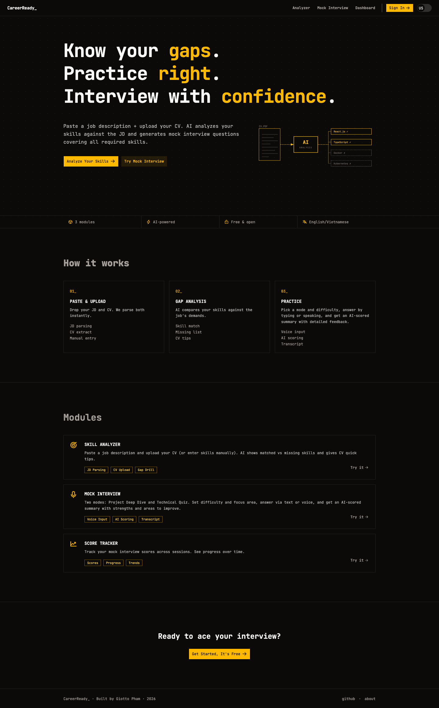

# CareerReady

> **Biết mình thiếu gì. Luyện đúng chỗ. Tự tin phỏng vấn.**
> Know your gaps. Practice right. Interview with confidence.

**Live:** [career-ready.site](https://career-ready.site)

CareerReady helps developers prepare for job interviews. Paste a job description and upload your CV — the AI analyzes your skills against the JD, surfaces matched/missing skills with CV quick tips, and generates a mock interview covering the gaps.



---

## Modules

| Module | Description |
|---|---|
| **Skill Analyzer** | Paste or upload a JD (PDF/DOCX) + upload CV (PDF) or enter skills manually. AI outputs matched skills, missing skills (with priority), and CV quick tips. |
| **Mock Interview** | Two modes — Project Deep Dive and Technical Quiz — generated from your CV/JD analysis. Answer via text or voice; AI scores the session and gives feedback with a full transcript. |
| **Dashboard** | Recent analyses, mock interview history, and score tracking across sessions. |

Note: there is currently no learning-roadmap generation feature — the Skill Analyzer surfaces gaps and CV tips, not a structured study plan.

---

## Monorepo Structure

```
dev-career-ready-monorepo/
├── apps/
│   ├── web/          # Vite + TanStack Router (React 19, Tailwind v4)
│   └── api/          # Express 5 + Drizzle ORM (runs via Bun)
├── packages/
│   └── shared/       # Shared Zod schemas and TypeScript types
├── package.json      # Bun workspaces root
└── tsconfig.json
```

---

## Tech Stack

| Layer | Technology |
|---|---|
| **Frontend runtime** | Vite 8, React 19 |
| **Routing** | TanStack Router (file-based) |
| **Styling** | Tailwind CSS v4, `clsx`, `tailwind-merge`, `tw-animate-css` |
| **UI primitives** | Base UI (`@base-ui/react`) |
| **Icons** | Phosphor Icons (`@phosphor-icons/react`) |
| **Font** | JetBrains Mono (`@fontsource-variable/jetbrains-mono`) |
| **Backend runtime** | Bun |
| **API framework** | Express 5 |
| **ORM** | Drizzle ORM + drizzle-kit |
| **Shared** | Zod schemas, TypeScript types |
| **Language** | TypeScript 6 |
| **Linting** | ESLint 10 (flat config) + Prettier |
| **Package manager** | Bun workspaces |

---

## Getting Started

```bash
bun install
```

### Dev servers

```bash
bun run dev:web      # Frontend at http://localhost:3000
bun run dev:api      # API with Bun --hot reload
```

### Quality checks

```bash
bun run type-check   # tsc across all workspaces
bun run lint         # ESLint across monorepo
```
